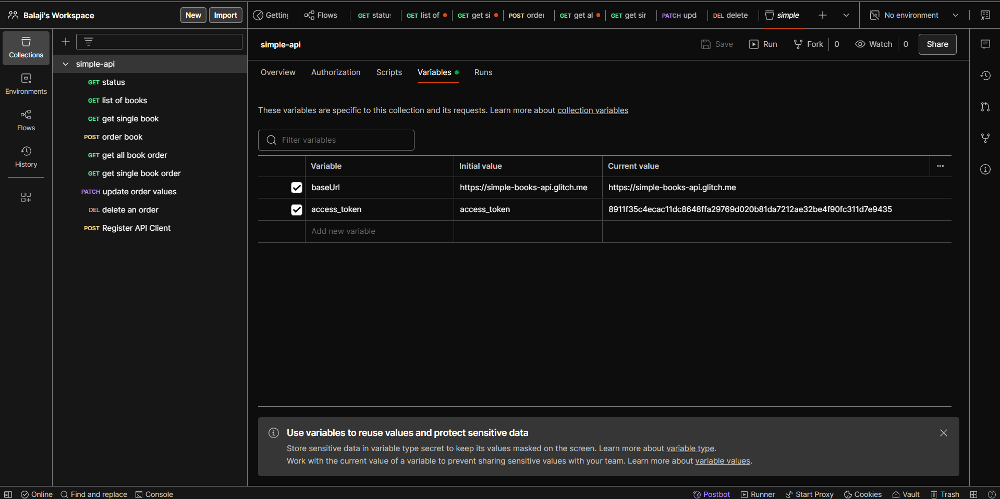

### Creating Collection called Simple API 

### Getting Status of the API

### Getting List Of Books 

### Get Single Book Details

### Order Book

### Get All Book Order

### Get Single Book Order

### Update Book Order

### Delete Book Order

### Register API Client

